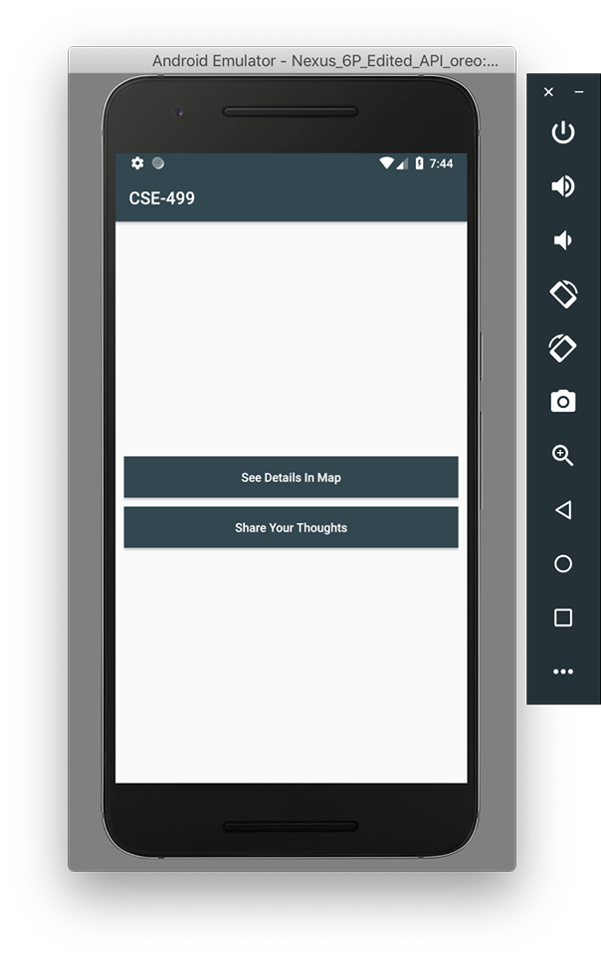
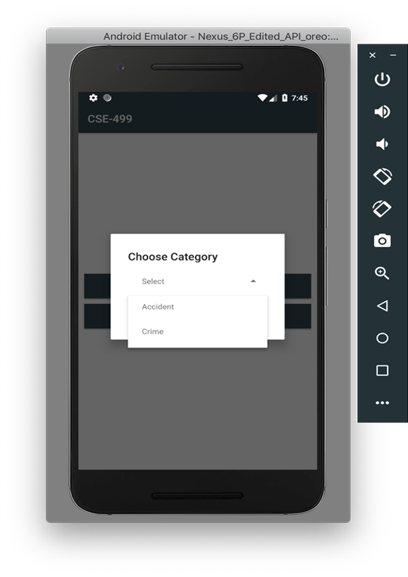
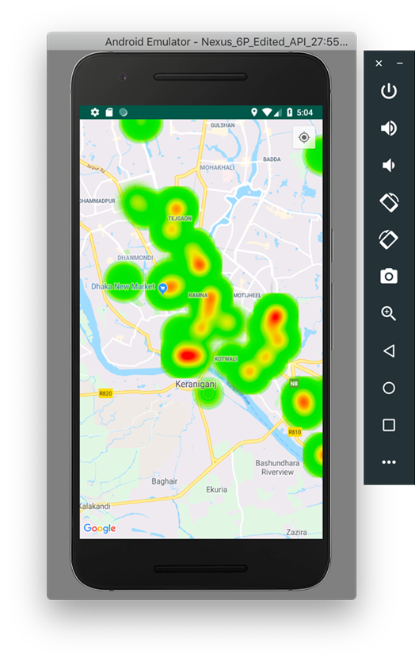
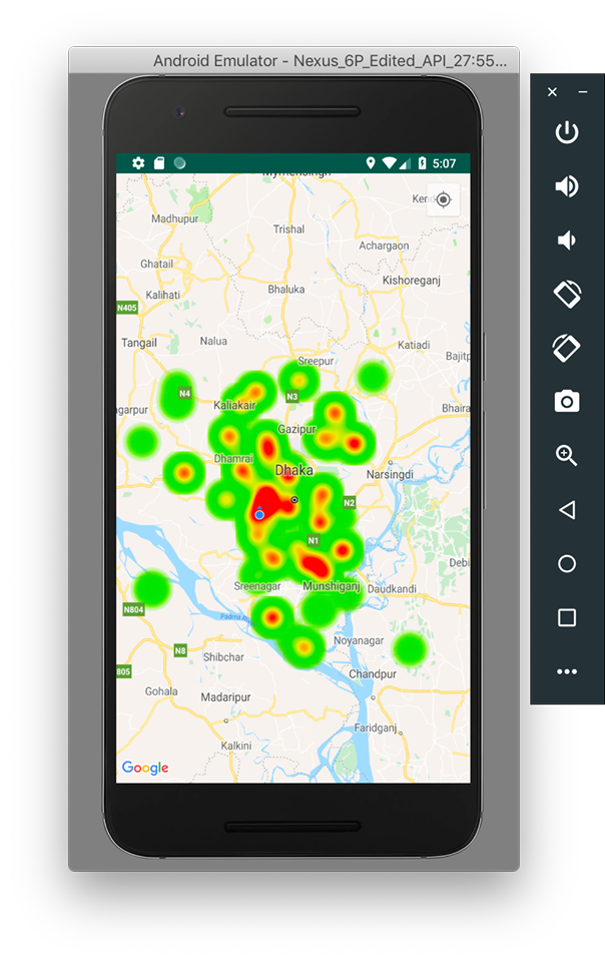
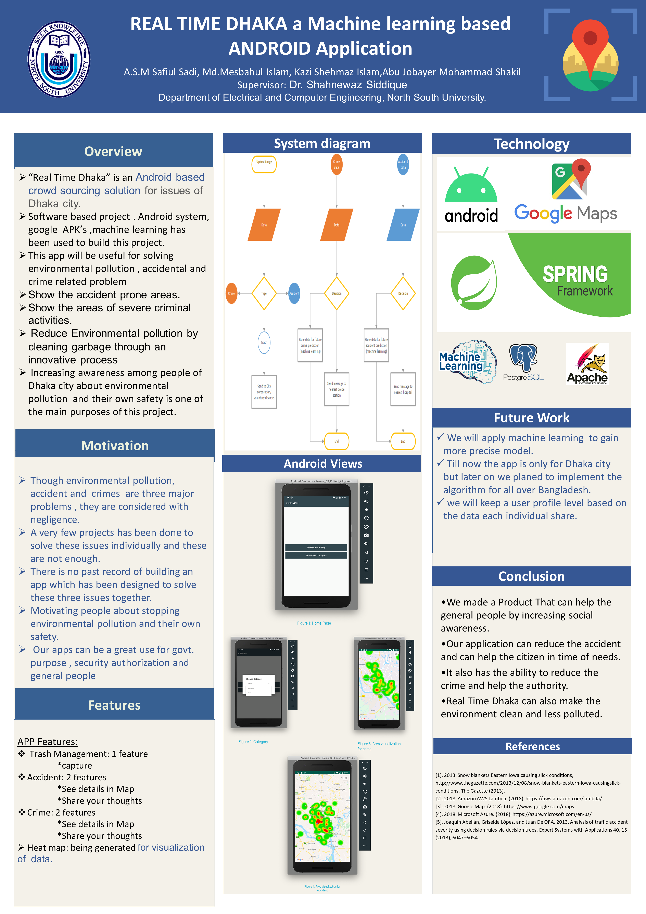

# Real-Time-Dhaka a machine learning base Android Application

Bangladesh is the ninth most populous and twelfth most densely populated country in the world. In the year of 2012 statics waste generation in Bangladesh is around 22.4 million tons per year. There is an increasing rate of waste generation in Bangladesh and it is projected to reach 47,064 tons per day by 2025. The total waste collection rate in major cities of Bangladesh such as Dhaka is only 37%.On the other hand Road accident also has become a big issue now a days in Bangladesh. At least 7,221 people were killed and 15,466 others injured in 5,514 road crashes in the year of 2018. Besides Dhaka is one of the most corrupted cities in the world. It has high crime rates like robbing, stealing, eve teasing,
To Solve prevent and reduce all these issue and to make the city livable we are going to develop an application which will make the city life easier and safe.
For trash management: Our application solves this issue just by one click. If a person sees some sort of garbage or pile of garbage lying on the road, they can take a snapshot of that and upload through the mobile application. Then the application gets the user’s location by using the phones GPS system and informs the city corporation and other voluntary cleaning groups to clean the garbage.
For crime reduction: To reduce crimes in this city we want to have a way that civilians can contribute to crime prevention and identification. If a person sees a crime happening in front of him, he can take a picture and upload it (can be used as an evidence). Which will send a message to the nearest police station. So, the police can take quick action about the crime that took place. By taking a picture we will be taking permission for phone location and message and also time information. By taking this, we will later use it for predicting crimes in certain places of the city and notify the people place where they should be alert or avoid. As our goal is to make the city safer
To reduce accident rate: Commonly, the traffic accident prediction problem has been formulated as a classification problem or a regression problem. For example, some work aims to predict whether or not an accident will occur at a specific location or in a specific area (e.g., road segment) during each time window (e.g., hour, day). Other work predicts the number of accidents at given time and locations using regression models. These works, however, typically use classical data mining methods and do not consider the unique features of traffic accident data such as spatial heterogeneity and temporal auto-correlation, leading to unsatisfactory performance. A limited number of recent works have made attempts to solve the problem using deep learning approaches, such as deep neural network or convolutional neural networks. In addition to this we are also working on accident prediction and fast ambulance service for road accident victims. Our aim is to get the location from any user who is nearby a place where an accident has occurred. Through our application we will search the nearest hospital and send an SOS message with the patient location through the app. So, the hospital can send a response ambulance as soon as possible. This is crucial because, one may have an accident in a place that is unknown to him. He does not have to know about the nearest hospital. This would be quick and efficient. This can be done by just taking a picture of the accident and its surroundings and uploading it through the app. 

Developed by :- Md. Mesbahul Islam.
                North South University
               Email: mesbahul.islam@northsouth.edu

# App Interface
  

# App Interface
 

# App Interface
 

# App Interface
 

# App Poster
 
